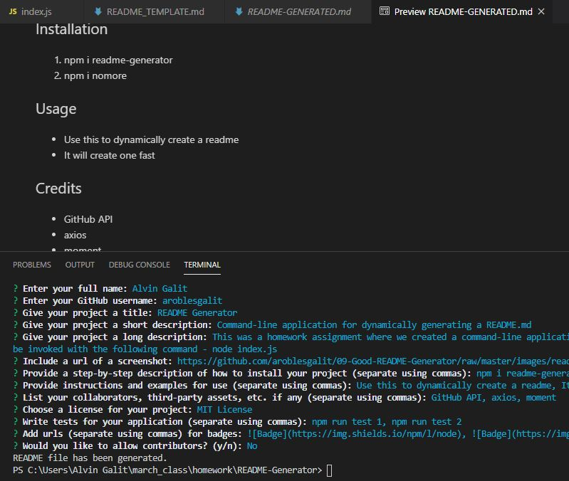

# README Generator       
> Command-line application for dynamically generating a README.md    

## Description  
This was a homework assignment where we created a command-line application that dynamically generates a README.md from a user's input. The application will be invoked with the following command - node index.js  

  

## Table of Contents  
* [Installation](#installation)
* [Usage](#usage)
* [Credits](#credits)
* [License](#license)
* [Contributing](#contributing)
* [Tests](#tests)
* [Questions](#questions)

## Installation  
1. npm i readme

## Usage  
* create a readme
*  generate one dynamically

## Credits  
* GitHub api
*  shields.io

## License  
    This project is licensed under the terms of the MIT License.

## Contributing  
Please note that this project is released with a Contributor Code of Conduct. By participating in this project you agree to abide by its terms. [Contributor Covenant Code of Conduct](https://www.contributor-covenant.org/version/2/0/code_of_conduct/)

## Tests  
* npm run test1
*  npm run test2
*  npm run test3

## Questions
You may address any questions to the author listed below:  

Name: __Alvin Galit__  
GitHub: [aroblesgalit](https://github.com/aroblesgalit)  

---
© 2020 Alvin Galit. All Rights Reserved.
